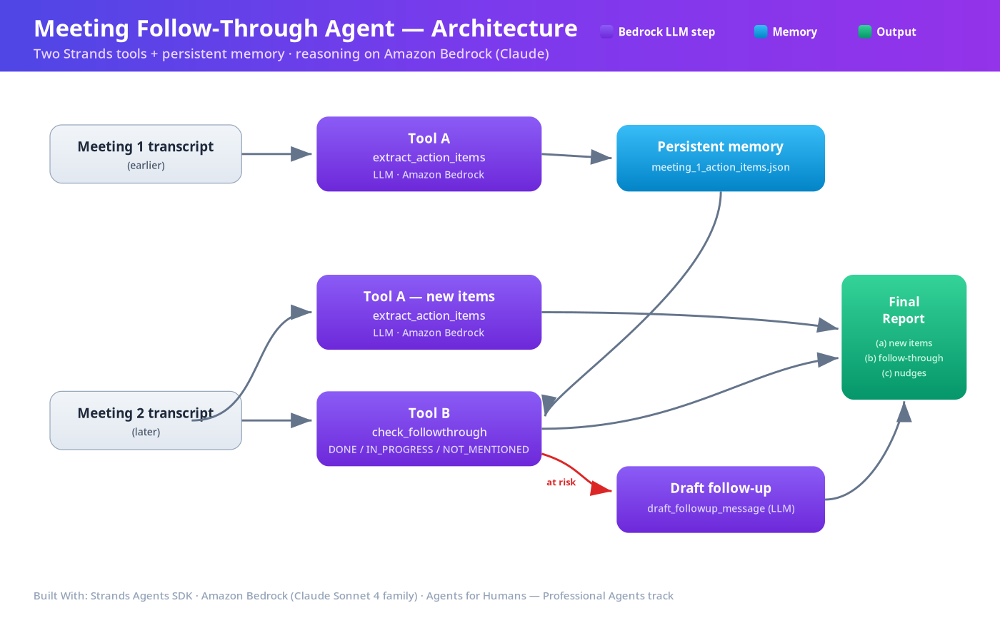
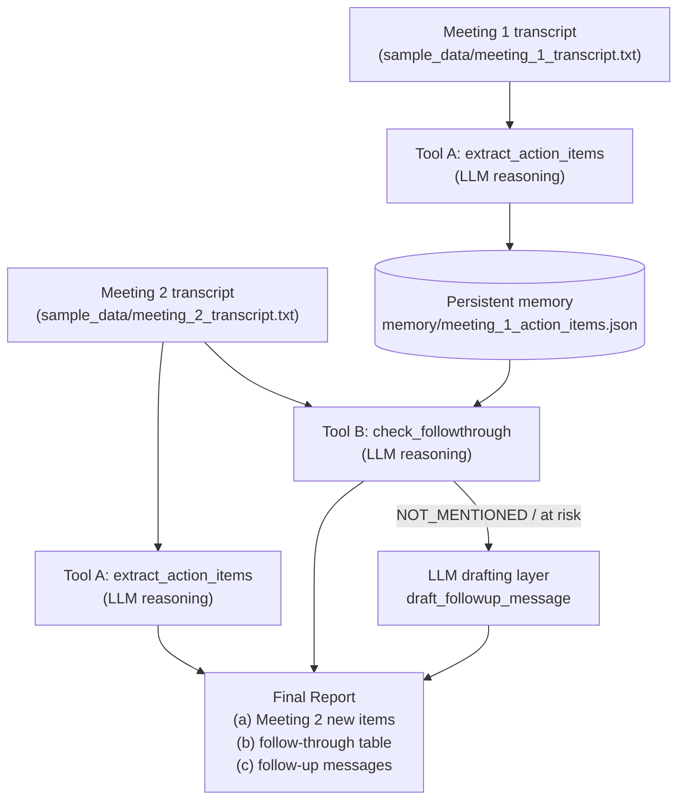

# Architecture

*(Rendered diagram: `docs/architecture.png` — upload this file to the Devpost
"Architecture diagram" field. Source: `docs/architecture.svg` / the Mermaid
below.)*

The Meeting Follow-Through Agent is built with the **Strands Agents SDK** and
uses a **two-tool design** plus a small local **persistent-memory** layer. That
combination is what makes it more than a plain meeting summarizer: it doesn't
just extract action items from one meeting, it *remembers* them and *checks*, at
the next meeting, whether they were actually done.

## Diagram

## Flow explanation

Meeting 1's transcript is run through **Tool A (`extract_action_items`)**, and
the resulting structured commitments are written to a local JSON file that
simulates persistent memory across meetings. When Meeting 2 happens, Tool A runs
again to capture that meeting's **new** action items, while **Tool B
(`check_followthrough`)** loads Meeting 1's items back out of memory and compares
them against Meeting 2's transcript to decide whether each one is `DONE`,
`IN_PROGRESS`, or `NOT_MENTIONED` (at risk). Any at-risk item is passed to an
**LLM drafting layer** that writes a polite status-update nudge to the owner.
Both tools use the LLM (via the Strands SDK's Amazon Bedrock provider) for the
natural-language extraction and comparison reasoning — the deterministic Python
code only orchestrates the tools and formats the report. This memory-plus-
follow-through loop across two meetings is precisely what elevates the agent
above a one-shot transcript summarizer.
